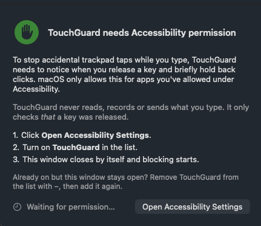

# TouchGuard


[](https://github.com/sjhorn/TouchGuard/actions/workflows/ci.yml)
[](https://github.com/sjhorn/TouchGuard/releases/latest)

[](LICENSE)

**Stop accidental trackpad clicks while you type.**

TouchGuard holds back trackpad clicks for a moment after each key release. A palm brushing the trackpad mid-sentence no longer counts as a tap, so the cursor stays where you're typing.

It lives in the menu bar and has a command-line tool (`touchguard`) for scripting. Both share the same small Swift core. TouchGuard is free and open source under the [MIT licence](LICENSE).

Based on the original [TouchGuard by SyntaxSoft](https://github.com/thesyntaxinator/TouchGuard) (2016). See [NOTICE](NOTICE).

<p align="center">
  
  &nbsp;&nbsp;
  
</p>

## Install

- **Download (recommended):** get `TouchGuard-<version>.dmg` from [Releases](https://github.com/sjhorn/TouchGuard/releases), open it, and drag TouchGuard to Applications. The app is signed with Developer ID and notarised by Apple. It updates itself with Sparkle (**Check for Updates…** in the menu).
- **Homebrew:** `brew install --cask sjhorn/tap/touchguard`. This installs the app and links the `touchguard` command-line tool onto your `PATH`.
- **Mac App Store:** submitted on a best-effort basis; this README will link it if Apple approves it. The App Store version is sandboxed, has no command-line tool and is updated by the store.

Requires macOS 14 Sonoma or later, on Apple silicon or Intel.

## Using it

TouchGuard runs only in the menu bar and has no Dock icon. The icon shows its state:

| Icon | Meaning |
|------|---------|
| ✋ `hand.raised` | Active: clicks are held back after typing |
| `hand.raised.slash` | Paused |
| ⚠️ `exclamationmark.triangle` | Needs permission, or the event tap couldn't start |
| 🔒 `lock` | Another app has secure input on, so typing can't be seen (see below) |

The menu has:

- the current status, e.g. "Active, 200 ms"
- **Enabled**, to turn blocking on or off (also **⌃⌥⌘T** from anywhere)
- **Delay** presets (100–500 ms) and **Custom…**, a slider from 50 to 1000 ms. Changes apply straight away.
- **Blocked clicks**, a count of the clicks held back, with **Reset Count**
- **Launch at Login**
- **Global Shortcut ⌃⌥⌘T**, to turn the hotkey on or off
- **Check for Updates…** (download version only), About, Quit


Settings are remembered between launches. The default delay is 200 ms. If the cursor still jumps, try a longer delay. If the trackpad feels slow after typing, try a shorter one.

## Permissions

TouchGuard has to notice key releases and briefly hold back clicks, and macOS only allows that with your permission. **It never reads, records or sends what you type.** It only checks *that* a key was released.

| Version | Permission | Where |
|---------|-----------|-------|
| Download (Developer ID) | Accessibility | System Settings → Privacy & Security → Accessibility |
| Mac App Store | Input Monitoring, plus Accessibility for holding back clicks | System Settings → Privacy & Security → Input Monitoring / Accessibility |

On first launch a window explains this and opens the right Settings page. Once you turn TouchGuard on, the window closes by itself and blocking starts. If the permission is removed later, the window comes back. No administrator rights are needed.

If TouchGuard is listed as allowed but the window stays open, remove it from the list with **−** and add it again. This usually happens after replacing the app with a build signed differently.

### Secure input

While another app has macOS **Secure Event Input** on, macOS hides typing from TouchGuard, so it can't block anything. Password fields, password managers and terminals' Secure Keyboard Entry all turn it on. TouchGuard then shows a 🔒 icon and "Not blocking: secure input is on". Close the app's password field or turn off Secure Keyboard Entry. If it stays stuck after the app quits, log out and back in. See the [FAQ](https://blog.hornmicro.com/TouchGuard/support/#secure-input).

### Reliability

macOS sometimes switches event taps off, for example when a callback is slow or around secure text input such as password fields. TouchGuard turns its tap back on at once when that happens. A watchdog also checks every 2 seconds, so blocking doesn't silently stop the way it could in 1.x.

## Privacy

TouchGuard collects no data. It has no analytics and no accounts, and it sends nothing anywhere. The only network request is the download version's update check, which fetches the [appcast](https://blog.hornmicro.com/TouchGuard/appcast.xml) from GitHub Pages. See the [privacy policy](https://blog.hornmicro.com/TouchGuard/privacy).

## Command-line tool

The download version includes the CLI inside the app. Homebrew links it for you. Otherwise, put it on your `PATH` with:

```sh
sudo ln -sf /Applications/TouchGuard.app/Contents/Helpers/touchguard /usr/local/bin/touchguard
touchguard -time 0.2
```

| Option | Meaning |
|--------|---------|
| `-time <sec>` | Block clicks for this many seconds after each key release (default `0.2`) |
| `-nodebug` | Print nothing |
| `-TapEnableMsg` | Print a message when clicks are allowed again |
| `-TapDisableMsg` | Print a message when a key release starts blocking |
| `-version` | Print the version |
| `-h` | Show help |

For the CLI, the Accessibility permission belongs to the app you run it from (Terminal, iTerm, …). If that app isn't allowed, `touchguard` names it, opens the system prompt and exits with status 1. Allow it, restart the terminal app, and run `touchguard` again. Keep the terminal open while you want TouchGuard running. Don't run the CLI and the menu bar app at the same time.

## Building from source

Requires Xcode 16 or later (the project is set up for Xcode 27).

```sh
git clone https://github.com/sjhorn/TouchGuard.git && cd TouchGuard
xcodebuild -scheme TouchGuard -configuration Release -derivedDataPath build/DD build
open build/DD/Build/Products/Release/TouchGuard.app
```

The project signs with the maintainer's team (`DEVELOPMENT_TEAM`). To build under your own account, change the team in Xcode or pass `DEVELOPMENT_TEAM=<yours>`. macOS ties the permission grant to the code signature, so expect to grant it again after switching identities.

Tests:

```sh
cd TouchGuardCore && swift test                      # core logic and tap state machine
xcodebuild -scheme TouchGuard test                    # also the app model tests
```

### Project layout

```
TouchGuard.xcodeproj    targets: TouchGuard (Developer ID), TouchGuardMAS (App Store, sandboxed),
                        TouchGuardCLI, TouchGuardTests
TouchGuardCore/         Swift package shared by the app and CLI
  ClickFilter           the pure pass/block decision logic
  EventTapController    tap lifecycle, re-enabling and watchdog
  TapBackend            the real CGEventTap behind a protocol (faked in tests)
  Permissions           permission mode, check, prompt and Settings link
TouchGuardApp/          SwiftUI menu bar app (shared by both app targets)
TouchGuardCLI/          command-line tool
TouchGuardTests/        app model tests
Config/                 Info.plist fragments
scripts/                release, version bump
docs/                   GitHub Pages site, appcast, App Store listing, architecture
.github/                CI and release workflows, issue and PR templates
```

## Releasing

Releases are made by [`scripts/release.sh`](scripts/release.sh), either locally or by GitHub Actions when a `v*` tag is pushed. See [docs/RELEASING.md](docs/RELEASING.md).

## Contributing

Contributions are welcome. See [CONTRIBUTING.md](CONTRIBUTING.md) for setup, tests and guidelines, and [docs/ARCHITECTURE.md](docs/ARCHITECTURE.md) for how it works. This project follows a [Code of Conduct](CODE_OF_CONDUCT.md).

## Support

Questions, bugs and ideas: [open an issue](https://github.com/sjhorn/TouchGuard/issues/new/choose). Common questions are answered on the [support page](https://blog.hornmicro.com/TouchGuard/support/). Security reports: see [SECURITY.md](SECURITY.md). More in [SUPPORT.md](SUPPORT.md).

## Licence

MIT. See [LICENSE](LICENSE). Third-party notices and credit for the original TouchGuard are in [NOTICE](NOTICE).
