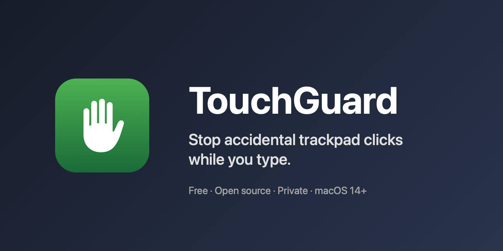
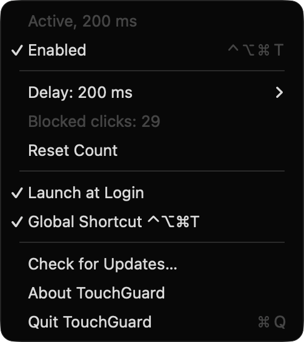
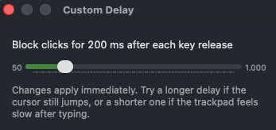

**Stop accidental trackpad clicks while you type.**

TouchGuard holds back trackpad clicks for a moment after each key release, so a palm brushing the trackpad mid-sentence doesn't move your cursor. It lives in your menu bar, is free and open source, and never reads what you type.

[**Download for macOS**](https://github.com/sjhorn/TouchGuard/releases/latest) · macOS 14 or later · signed and notarised

  
  &nbsp;
  

## Features

- Blocks clicks for 50–1000 ms after each key release (default 200 ms)
- Turn it on or off from the menu bar or with ⌃⌥⌘T
- Counts the clicks it held back, so you can see it working
- Launch at Login
- Recovers by itself when macOS switches its event tap off
- Updates itself
- For power users: a `touchguard` command-line tool

## Links

- [Support and FAQ](support)
- [Privacy policy](privacy)
- [Source code on GitHub](https://github.com/sjhorn/TouchGuard)
- [Changelog](https://github.com/sjhorn/TouchGuard/blob/master/CHANGELOG.md)

Based on the original TouchGuard by SyntaxSoft (2016).
