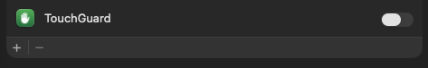

# TouchGuard Support

Can't find your answer here? [Open an issue on GitHub](https://github.com/sjhorn/TouchGuard/issues/new) and include your macOS version and TouchGuard version (menu → About TouchGuard).

## Frequently asked questions

### Why does TouchGuard need Accessibility or Input Monitoring permission?
To hold back a click, TouchGuard has to see that you just released a key and then stop the click from reaching other apps. macOS only lets apps do this with your permission. TouchGuard **never reads which keys you press or what you type**. It only checks *that* a key was released.

- Download version: **System Settings → Privacy & Security → Accessibility**, turn on TouchGuard:

  

- Mac App Store version: **System Settings → Privacy & Security → Input Monitoring**, turn on TouchGuard, and also under **Accessibility**.

### I turned the permission on, but the window won't go away.
Select TouchGuard in the list, remove it with **−**, then add it again with **+** (or reopen TouchGuard). This happens when macOS remembers an older copy of the app.

### TouchGuard says "Not blocking: secure input is on". {#secure-input}
Some apps turn on macOS **Secure Event Input** to protect what you type. Password fields, password managers, and terminals with **Secure Keyboard Entry** switched on all do this. While it's on, macOS hides typing from every app, TouchGuard included, so TouchGuard can't tell when you've just typed and lets every click through. TouchGuard never turns it on itself.

- Close the password field or window you were using, or switch to another app.
- In your terminal (Terminal, iTerm, Ghostty, …), turn off **Secure Keyboard Entry** in its app menu.
- Lock or quit your password manager.
- Sometimes it stays stuck on after the app that turned it on has quit. **Logging out and back in** always clears it.

TouchGuard goes back to "Active" by itself within a couple of seconds once secure input is off.

### TouchGuard says "Active" but never blocks anything. {#active-but-not-blocking}
TouchGuard isn't seeing your typing. Check, in this order:

1. **Secure input.** If the menu bar icon is a 🔒, see [the secure input answer](#secure-input).
2. **Input Monitoring.** Open **System Settings → Privacy & Security → Input Monitoring**. The download version doesn't need to be listed there. But if **TouchGuard is listed and switched off**, macOS hides your typing from it, even with Accessibility on. Switch it on, or remove it with **−**, then quit and reopen TouchGuard. (The App Store version needs it switched on.)
3. **Old copies.** If you've had more than one copy of TouchGuard (for example a beta build), remove every TouchGuard entry from Accessibility and Input Monitoring. Then open the copy in Applications and grant permission again.

### The cursor still jumps while I type.
Choose a longer delay: menu → **Delay** → 300 or 500 ms, or **Custom…**.

### The trackpad feels slow right after I type.
Choose a shorter delay, such as 100 or 150 ms.

### Does it block the trackpad completely?
No. It only holds back *clicks and taps* for a moment after a key release. The pointer still moves, scrolling still works, and clicks work normally the rest of the time.

### Does it work with an external mouse?
It holds back clicks from any pointing device during the short window after typing. Most people never notice it with a mouse, since the window is so short.

### How do I start it automatically?
Menu → **Launch at Login**.

### How do I turn it off quickly?
Press **⌃⌥⌘T**, or use **Enabled** in the menu.

### How do I uninstall it?
If you installed it with Homebrew, run `brew uninstall --cask touchguard` (add `--zap` to also remove its settings). Otherwise, quit TouchGuard, drag it from Applications to the Trash, and remove it from **Privacy & Security → Accessibility** (and Input Monitoring) if it's still listed.

### Is there a command-line version?
Yes, in the download version: `/Applications/TouchGuard.app/Contents/Helpers/touchguard -h`. See the [README](https://github.com/sjhorn/TouchGuard#command-line-tool).

### Is TouchGuard free?
Yes. It's free and open source under the MIT licence.
